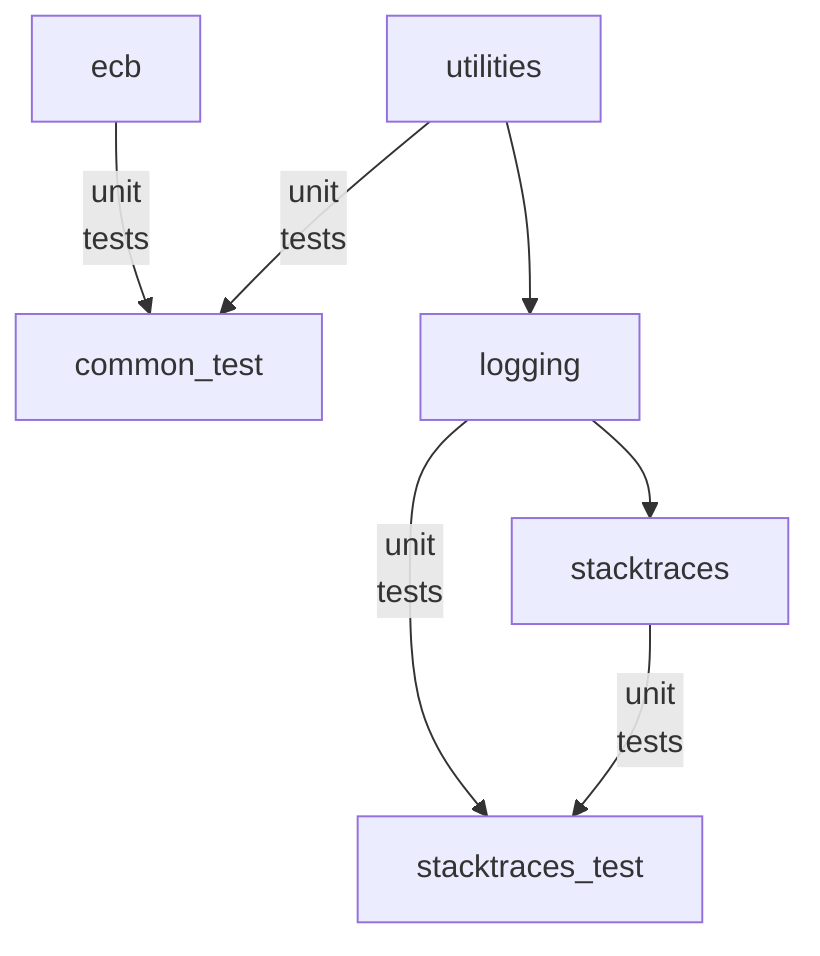

Copyright &copy; Kirk Rader 2024

# Go Utilities

This repository is organized as a Go module with six packages:

* Root directory contains a _go.mod_ file for `parasaurolophus/go`

* [utilities](./utilities/) contains a `utilities` package which provides a
  number of general-purpose utility functions and types

* [stacktraces](./stacktraces) contains a `stacktraces` package which provides
  support for including stack traces in `error` messages and log entries

* [logging](./logging) contains a `logging` package that provides a wrapper for
  `log/slog`

* [stacktraces_test](./stacktraces_test/) contains helper functions used in unit
  tests for both the `stacktraces` and `logging` packages

* [common_test](./common_test/) defines features available to unit tests for all
  of these packages, for example embedded test files

* [ecb](./ecb/) contains a package for experiments involving the European
  Central Bank's exchange data feeds

