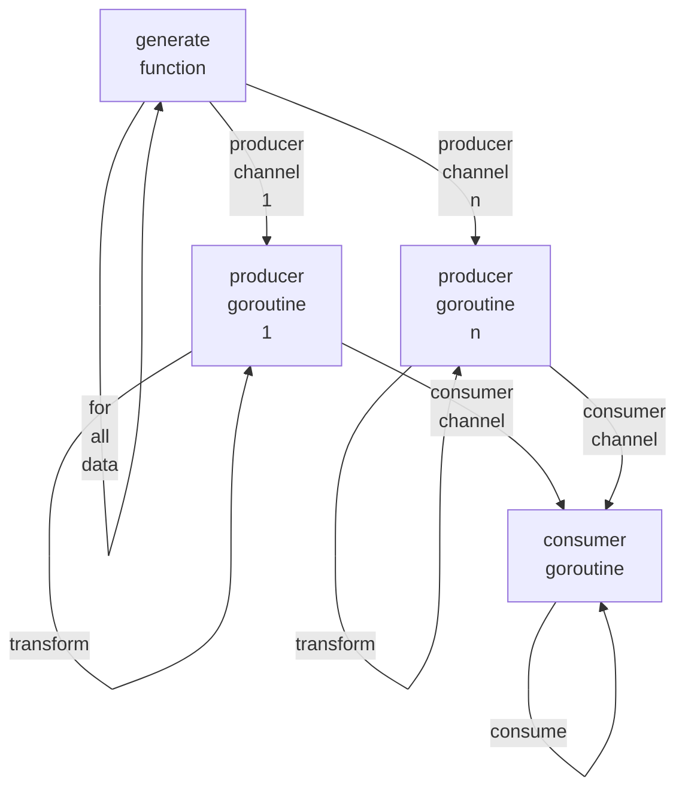

Copyright &copy; Kirk Rader 2024

# Go Examples

Various [Go](https://go.dev) coding examples.

## ProcessBatch

```mermaid
graph TB

    generate[generate<br>function]
    producer1[producer<br>goroutine<br>1]
    producern[producer<br>goroutine<br>n]
    consumer[consumer<br>goroutine]

    generate -- for<br>all<br>data --> generate
    generate -- producer<br>channel<br>1 --> producer1
    producer1 -- transform --> producer1
    producer1 -- consumer<br>channel --> consumer
    generate -- producer<br>channel<br>n --> producern
    producern -- transform --> producern
    producern -- consumer<br>channel --> consumer
    consumer -- consume --> consumer
```
