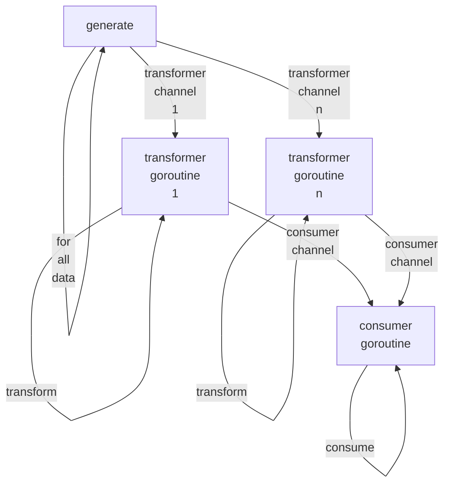

Copyright &copy; Kirk Rader 2024

# Go Examples

Various [Go](https://go.dev) coding examples.

## ProcessBatch



```go
func TestProcessBatch(t *testing.T) {
	actual := 0.0
	generate := func(transformers []chan<- int) {
        n := len(transformers)
		for i := range 9 {
			transformers[i%n] <- i
		}
	}
	transfrom := func(input int) float64 {
		return float64(input) / 2.0
	}
	consume := func(output float64) {
		actual += output
	}
	utilities.ProcessBatch(3, generate, transfrom, consume)
	if actual != 18 {
		t.Errorf("expected 18, got %f", actual)
	}
}
```