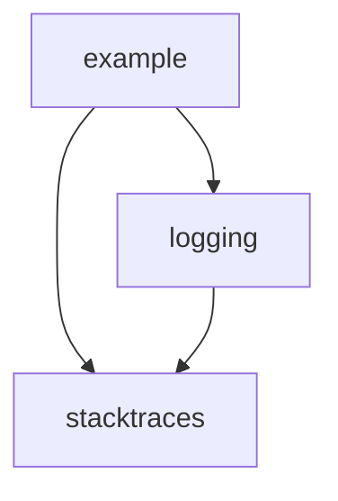

Copyright &copy; Kirk Rader 2024

# Go Utilities

This repository is organized as a Go module with three packages:

* Root directory contains a _go.mod_ file for `parasaurolophus/go`

* [stacktraces](./stacktraces) contains a `stacktraces` package which provides
  support for including stack traces in `error` messages and log entries

* [logging](./logging) contains a `logging` package that provides a wrapper for
  `log/slog`

* [example](./example) defines a stand-alone executable (a `main()` function in
  package `main`) that demonstrates the use of these packages

See [example/README.md](./example/README.md),
[logging/README.md](./logging/README.md) and
[stacktraces/README.md](./stacktraces/README.md) for more information.
