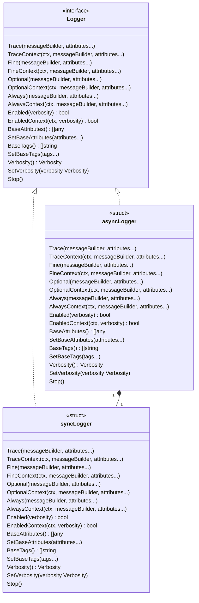

_Copyright &copy; Kirk Rader 2024_

# Wrapper for `log/slog`



---

```
$ go doc -all
package logging // import "parasaurolophus/go/logging"


CONSTANTS

const (

	// Logger.Defer() and Logger.DeferContext() will include the value returned
	// by recover() when logging a panic.
	RECOVERED = "recovered"

	// Values of "stacktrace" attributes will be replaced with one-line stack
	// traces for the function that called the given logging method.
	STACKTRACE = "stacktrace"

	// Value will be merged with the currently configured
	// LoggerOptions.BaseTags.
	TAGS = "tags"
)
    Specially handled attributes.

const (
	ALERT      = "ALERT"
	DEBUG      = "DEBUG"
	ERROR      = "ERROR"
	INJECTED   = "INJECTED"
	LOGGING    = "LOGGING"
	MONITORING = "MONITORING"
	PANIC      = "PANIC"
)
    Standard tags.

const (

	// Only emit a log entry when extremely verbose output is specified.
	//
	// Intended for use in development environments for focused debugging
	// sessions. This should never be enabled outside of development
	// environments. Any logging that might potentially reveal PII, SPI or
	// critically sensitive security information must only be written at TRACE
	// level in environments where only synthetic or redacted data is in use.
	TRACE = Verbosity(slog.LevelDebug)

	// Only emit a log entry when unusually verbose output is specified.
	//
	// Intended for use in development environments for everyday testing and
	// troubleshooting prior to a release candidate being deployed.
	FINE = Verbosity(slog.LevelInfo)

	// Only emit a log entry when moderately verbose output is specified.
	//
	// Intended for use in testing and staging environments, e.g. during
	// acceptance and regression tests before release to production.
	OPTIONAL = Verbosity(slog.LevelWarn)

	// Always emit a log entry.
	//
	// Intended for production environments to drive monitoring, alerting and
	// reporting.
	ALWAYS = Verbosity(slog.LevelError)
)
    Mapping of Verbosity to slog.Level values.

    Generally, assume that only ALWAYS will be enabled in production
    environments and that TRACE will never be enabled outside of development
    environments.


TYPES

type Logger interface {

	// Log at TRACE verbosity.
	Trace(message MessageBuilder, attributes ...any)

	// Log at TRACE verbosity using the supplied context.
	TraceContext(ctx context.Context, message MessageBuilder, attributes ...any)

	// Log at FINE verbosity.
	Fine(message MessageBuilder, attributes ...any)

	// Log at FINE verbosity using the supplied context.
	FineContext(ctx context.Context, message MessageBuilder, attributes ...any)

	// Log at OPTIONAL verbosity.
	Optional(message MessageBuilder, attributes ...any)

	// Log at OPTIONAL verbosity using the supplied context.
	OptionalContext(ctx context.Context, message MessageBuilder, attributes ...any)

	// Log at ALWAYS verbosity.
	Always(message MessageBuilder, attributes ...any)

	// Log at ALWAYS verbosity using the supplied context.
	AlwaysContext(ctx context.Context, message MessageBuilder, attributes ...any)

	// Return true if and only if the specified verbosity is enabled.
	Enabled(verbosity Verbosity) bool

	// Return true if and only if the specified verbosity is enabled using
	// the specified context.
	EnabledContext(ctx context.Context, verbosity Verbosity) bool

	// Return the enabled verbosity level.
	Verbosity() Verbosity

	// Update the enabled verbosity level.
	SetVerbosity(verbosity Verbosity)

	// Return the base attributes.
	BaseAttributes() []any

	// Update the base attributes.
	SetBaseAttributes(attributes ...any)

	// Return the base tags.
	BaseTags() []string

	// Update the base tags.
	SetBaseTags(tags ...string)

	// Stop any asynchronous goroutines associated with this logger.
	Stop()
}
    Interface implemented by objects that wrap slog.Logger using a better
    nomenclature for "levels."

func New(writer io.Writer, options *LoggerOptions) Logger
    Returns a newly created, wrapped instance of slog.Logger.

    Log entries written using the returned Logger instance will have
    "verbosity" attributes instead of "level" attributes and the values of
    their "stacktrace" attributes, if present, will be replaced as if by an
    invocation of ShortStackTrace(skipFrames) where skipFrames is the value
    of the "stacktrace" attribute passed to a logging method. The final set of
    attributes for each log entry will be the result of combining the value of
    LoggerOptions.BaseAttributes and LoggerOptions.BaseTags with the attributes
    passed to the given logging method.

    For example:

        type Counters struct {
            Error1 int `json:"error1"`
            Error2 int `json:"error2"`
        }

        counters := Counters{}

        options := logging.LoggerOptions{
            BaseAttributes: []any{"counters", &counters},
            BaseTags:       []string{"foo", "bar"},
        }

        logger := logging.New(os.Stdout, &options)
        n := 42
        counters.Error1 += 1

        logger.Optional(
            func() string { return fmt.Sprintf("n = %d", n) },
            logging.STACKTRACE, nil,
            logging.TAGS, []string{"hoo"},
            "baz", "waka")

    produces a log entry like:

        {"time":"2024-02-11T06:16:41.852302853-06:00","verbosity":"OPTIONAL","msg":"n = 42","counters":{"error1":1,"error2":0},"baz":"waka","stacktrace":"5:main.main [/source/go/scratch/scratch.go:29] < 6:runtime.main [/usr/local/go/src/runtime/proc.go:267] < 7:runtime.goexit [/usr/local/go/src/runtime/asm_arm64.s:1197]","tags":["foo","bar","hoo"]}

    Note that if LoggerOptions.ReplaceAttr is not nil, it will be called
    as described by the documentation for slog.HandlerOptions.ReplaceAttr
    indirectly through a custom replacer function that replaces "level" with
    "verbosity" as just described.

    Note also that the values for attributes in LoggerOptions.BaseAttributes may
    be passed by value or reference. Passing by reference allows for cases where
    each log entry should include the current value for that attribute rather
    than a copy of the value at the time the Logger was created.

func NewAsync(writer io.Writer, options *LoggerOptions) Logger

type LoggerOptions struct {

	// Allow panics in Logger.log() to cause abnormal process termination.
	AllowPanics bool

	// Initial set of attributes that will be added to every log entry.
	BaseAttributes []any

	// Initial set of tags that will be added to every log entry.
	BaseTags []string

	// Pass through to HandlerOptions for the wrapped slog.Logger.
	AddSource bool

	// Shared slog.LevelVar, if desired; a Leveler will be created if this is
	// nil.
	Level *slog.LevelVar

	// If not nil, an attribute replacer function that will be called in
	// addition to replacing "level" attributes with "verbosiy" and other
	// special attribute handling.
	ReplaceAttr func([]string, slog.Attr) slog.Attr
}
    Configuration parameters for an instance of Logger.

type MessageBuilder func() string
    Type of function passed to logging methods for lazy evaluation of message
    formatting.

    The returned string becomes the value of the log entry's msg attribute.

    Such a function is invoked only if a given verbosity is enabled for a given
    logger.

type Verbosity int
    Verbosity-based nomenclature used in place of slog.Level.

func (v *Verbosity) Scan(state fmt.ScanState, verb rune) error
    Implement the fmt.Scanner interface.

func (v Verbosity) String() string
    Implement fmt.Stringer interface for Verbosity.

```
