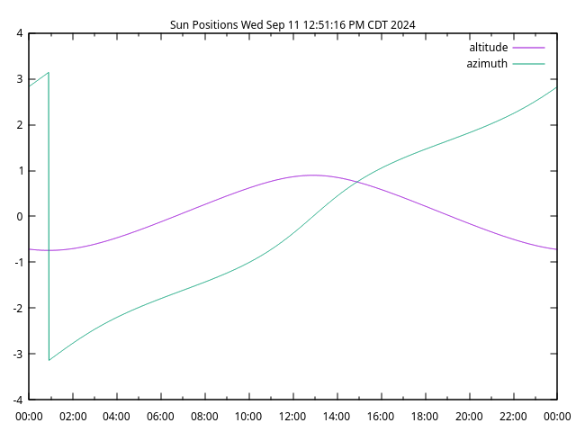

Copyright 2024 Kirk Rader

# Positions

Generate a CSV file containing the sun's altitude and azimuth for each minute
of the current day. Include a `Makefile` and `gnuplot` configuration file that
can be used to graph the CSV data.

```bash
# using make
make

# without make
go build
./positions > positions.csv
gnuplot -p -e "D='`date`'" positions.gnuplot
```


