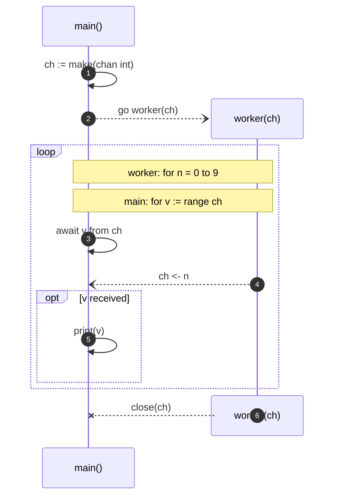

_Copyright &copy; Kirk Rader 2024_

# Concurrency in Go

Go provides to built-in mechanisms that work together to provide what is claimed
to be an extremely light weight yet safe to use concurrency: channels and goroutines.

> "Goroutine" is Go terminology for an asynchronously executing co-routine.
> Don't forget to tip the wait staff!

A channel functions as a goroutine-safe message queue. A goroutine is simply an
ordinary Go function that is invoked using the `go` keyword.

```go
package main

import (
	"fmt"
)

// Send 0 ... 9 to ch then close it.
func worker(ch chan int) {

	// Use defer to ensure that ch is always closed so as to reduce the risk of
	// deadlocks.
	defer close(ch)

	for n := 0; n < 10; n += 1 {

		ch <- n
	}
}

// Prints
//
//	0
//	1
//	2
//	3
//	4
//	5
//	6
//	7
//	8
//	9
//
// to stdout.
func main() {

	ch := make(chan int)

	// A function invoked using the go keyword is launched as a concurrently
	// running goroutine.
	go worker(ch)

	// A loop that "ranges over" a channel is Go's standard idiom for consuming
	// values from that channel. The channel will block the main goroutine at
	// each iteration until the worker goroutine sends a message and the loop
	// terminates when the channel is closed. I.e. channels are used both to
	// communicate between goroutines and to synchronize their activities.
	for v := range ch {

		fmt.Printf("\t%2d\n", v)
	}
}
```

Here is what happens when the preceding is executed:



As noted in the comments in that example, channels act both as communication and
synchronization mechanisms between goroutines. Go's designers' claim is that
using channels in patterns similar to that shown in the example code results in
"thread safe" goroutines with less overhead than actual threads.

> That said, the Go standard library also includes more conventional
> synchronization primitives, e.g. mutexes inspired by the Linux native
> _pthread_ library. Presumably, using such primitives results in higher
> overhead compared to channels.

It is worth noting that you can create multiple channels, each of which is
declared to send values of some particular type. For example, you could create
two channels by which two goroutines could exchange messages bidirectionally.
The more complex such scenarios become, the more likely you are to accidentally
introduce cases of deadly embrace and similar synchronization bugs. Under most
circumstances:

- The goroutine that sends messages on a channel should be the one to close it
  after execution is complete (ideally in a fashion protected by `defer`)

- The goroutine that receives messages on a channel should wait to exit until
  that channel is closed so as to give its partner goroutine a chance to finish
  gracefully.

The combination of those two rules shows why bidirectional communication
requires care. The program will hang if both goroutines finish their own
execution but then wait for the other to close the channel(s) on which they send
messages before closing the channel(s) on which they receive them.
