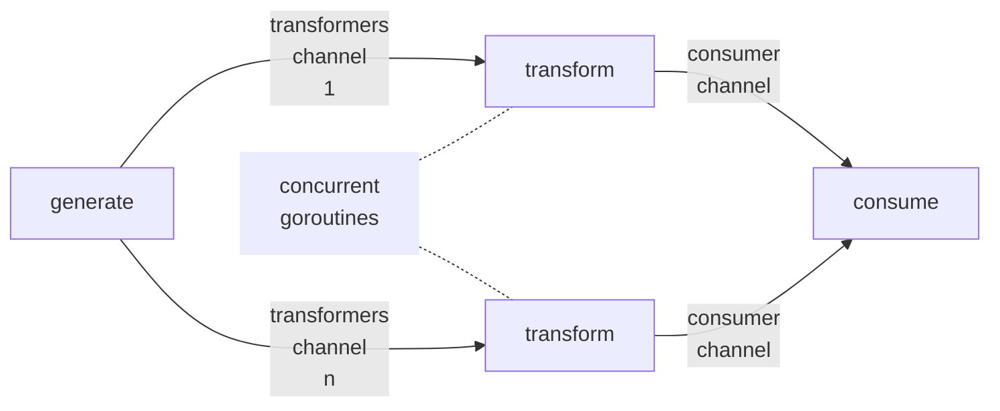

_Copyright 2024 Kirk Rader_

# parasaurolophus/utilities

```
package utilities // import "parasaurolophus/utilities"


FUNCTIONS

func CloseAllAndWait[V any](values []chan<- V, await *sync.WaitGroup)
    Close all of the given values channels then wait for the given group to
    signal that all workers have exited cleanly. For example:

        {
          values, await := StartWorkers(n, handler)
          defer CloseAllAndWait(values, await)
          for i, value := range data {
            values[i%n] <- value
          }
        }

    See StartWorkers

func CloseAndWait[V any](values chan<- V, await <-chan any)
    Close the given values channel then wait for the given await channel to be
    closed. For example:

        {
          values, await := StartWorker(handler)
          defer CloseAndWait(values, await)
          for _, value := range data {
            values <- value
          }
        }

    See StartWorker

func MakeCSVConsumer(

        writer *csv.Writer,
        headers []string,
        errorHandler func(error),

) (

        consumer func(CSVConsumerParamters),

)
    Return a function for use as the consume parameter to ProcessBatch. The
    returned function will write each received row to the given CSV file. Any
    errors encountered along the way will be passed to the given errorHandler
    function.

    See ProcessBatch, MakeCSVGenerator

func MakeCSVGenerator(

        reader *csv.Reader,
        headers []string,
        startRow int,
        errorHandler func(error),

) (

        generator func([]chan<- CSVTransformerParameters),
        err error,

)
    Return a function for use as the generate parameter to ProcessBatch.
    The returned function reads the rows of the given CSV file, sending each
    to the batch's transformers channels in round-robin fashion. Any errors
    encountered along the way will be passed to the given errorHandler function.
    Note that the column headers and starting row number are passed in here so
    as to support CSV's without a headers row.

    See ProcessBatch, MakeCSVConsumer

func ProcessBatch[Input any, Output any](

        numTransformers int,
        transformersBufferSize int,
        consumerBufferSize int,
        generate func(transformers []chan<- Input),
        transform func(Input) Output,
        consume func(Output),

)
    Process items in a set of data concurrently. Specifically, start n+1
    goroutines and wait for them all to complete after invoking the given
    generator function. The generator function must send input values in a
    round-robin fashion to the set of transformer channels it is passed.
    The transformer goroutines will send the result of invoking the given
    transform function to the consumer goroutine, which invokes the given
    consume function:

                           +-----------+
                      +-->>| transform |----+
                      |    +-----------+    |
                      |          .          |
        +----------+  |          .          |    +---------+
        | generate |--+     concurrent      |-->>| consume |
        +----------+  |     goroutines      |    +---------+
                      |          .          |
                      |          .          |
                      |    +-----------+    |
                      +-->>| transform |----+
                           +-----------+

    Note that this function will hang if any of the generate, transform or
    consume functions do not return. If your transform function invokes some SDK
    function or API that can hang, consider the use of WithTimeLimit to allow
    the batch to run to completion even if some operations would otherwise block
    it (but then be aware of the consequences of resulting resource leaks).

    See CloseAndWait, CloseAllAndWait, StartWorker, StartWorkers

func StartWorker[V any](

        bufferSize int,
        handler func(V),

) (

        values chan<- V,
        await <-chan any,

)
    Start a goroutine which will invoke the given handler for each item sent to
    the returned values channel, until it is closed, at which time it will close
    the await channel before exiting.

        {
          values, await := StartWorker(bufferSize, handler)
          defer CloseAndWait(values, await)
          for _, value := range data {
            values <- value
          }
        }

    See CloseAndWait, StartWorkers

func StartWorkers[V any](

        numWorkers int,
        bufferSize int,
        handler func(V),

) (

        values []chan<- V,
        await *sync.WaitGroup,

)
    Start the specified number of goroutines, each of which will invoke the
    given handler for each item sent to one of the returned values channels.
    The returned wait group's counter will be set initially to the number of
    goroutines specified by n. Each goroutine will decrement the returned wait
    group's counter before terminating when the value channel to which it is
    listening is closed. group's count. For example:

        {
          values, await := StartWorkers(numWorkers, bufferSize, handler)
          defer CloseAllAndWait(values, await)
          for i, value := range data {
            values[i%numWorkers] <- value
          }
        }

    See CloseAllAndWait, StartWorker

func WithTimeLimit[V any](

        fn func() V,
        timeout func(time.Time) V,
        timeLimit time.Duration,

) V
    Invoke fn asynchronously. Return its value if it completes within the
    specified duration. Otherwise, return the value of calling the timeout
    function.

    Warning! the goroutine used to invoke fn constitutes a resource leak
    if it never completes, so use this function with caution. For example,
    it would be reasonable to invoke WithTimeLimit in a console application,
    a lambda's request handler function or any similar "one and done" flow.
    But Go provides no mechanism for forcibly terminating a goroutine,
    so long-running processes should not use this function (or any that involve
    goroutines that could possibly hang).


TYPES

type CSVConsumerParamters struct {
        CSVTransformerParameters
        Output map[string]string
}
    Data required on consuper channel by functions created using
    MakeCSVConsumer.

    See ProcessBatch, MakeCSVGenerator, MakeCSVConsumer

type CSVTransformerParameters struct {
        Row   int
        Input map[string]string
}
    Data sent to transformers channel by functions created using
    MakeCSVGenerator.

    See ProcessBatch, MakeCSVGenerator, MakeCSVConsumer
```

Here is a more legible version of the ASCII art diagram in the doc comment for
`ProcessBatch`:


